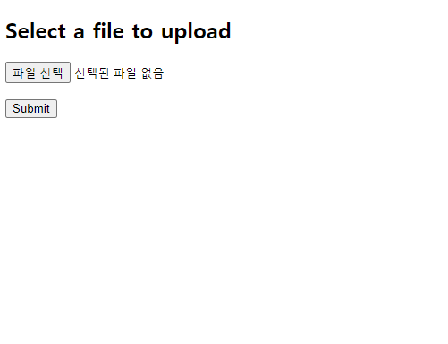
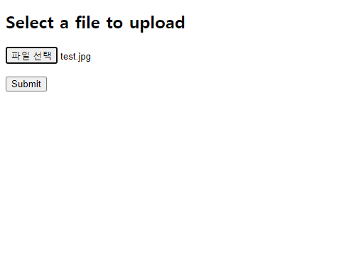
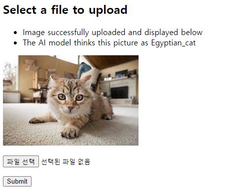
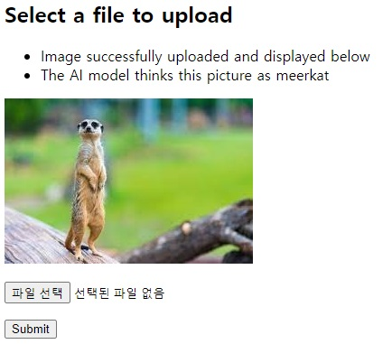
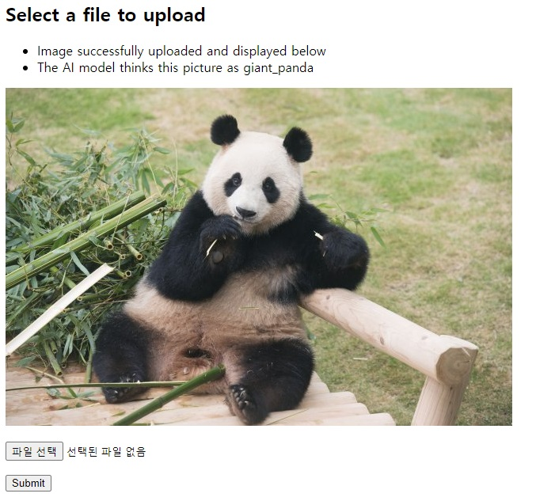

# AI Sever
## 인공지능 배포를 위해 필요한 서버와 이를 이용하는 Client를 만드는 Toy Project입니다.

### 제작자 : 김진환

### 개발 중....

### 사용 언어 및 툴

- 서버 :  

- 클라이언트 : 

## 실행 방법

Server를 실행 시킨다.
```
cd server
python test_sever.py
```
이후 http://127.0.0.1:5000/ 에 들어간다.

들어가면 아래와 같은 화면이 나올 것이다.



이후 파일 선택 버튼 을 눌러 파일을 업로드 한다.

이때 사용 가능한 파일 확장자는 다음과 같다.

jpg, jpeg, gif

파일을 선택하게 되면 다음과 같은 화면이 될것이다.



이후 submit 버튼을 클릭하면 다음과 같은 결과가 나온다.



test 결과
,  , 


### 🤘Complete
- Sever
    - 베타 서버 만들기
        1. 서버가 클라이언트에게 이미지를 받을 수 있다.
        2. 서버가 이미지를 model에 feed 시키고 이에 대한 결과를 뽑을 수 있다.
        3. 서버는 해당 결과를 client에게 다시 전송한다.
        4. 서버는 client의 message를 받아서 처리할 수 있다.

- Client
    - 테스트 Client 만들기
        - Home 페이지에 접속 가능한 client : Home_client.py
        - Message 전송 하는 client : Message_client.py
        - 이미지 전송 관련 client : Image_client.py
    - 앱 client 만들기
        - 서버와 통신 가능한 앱 만듬.
    - 웹 client 만들기
### 💪 To do

- Sever
    1. 로그인 기능  추가하기
- Client
  1. 앱 클라이언트 만들기
        - 사진 갤러리에서 가져오는 버튼 만들기
        - 사진 전송하는 거 만들기
        - 결과 받아와서 화면에 출력하는거 만들기
  


